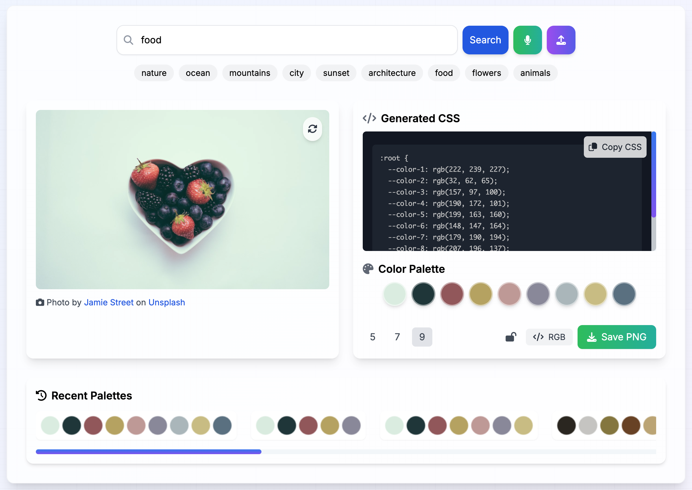
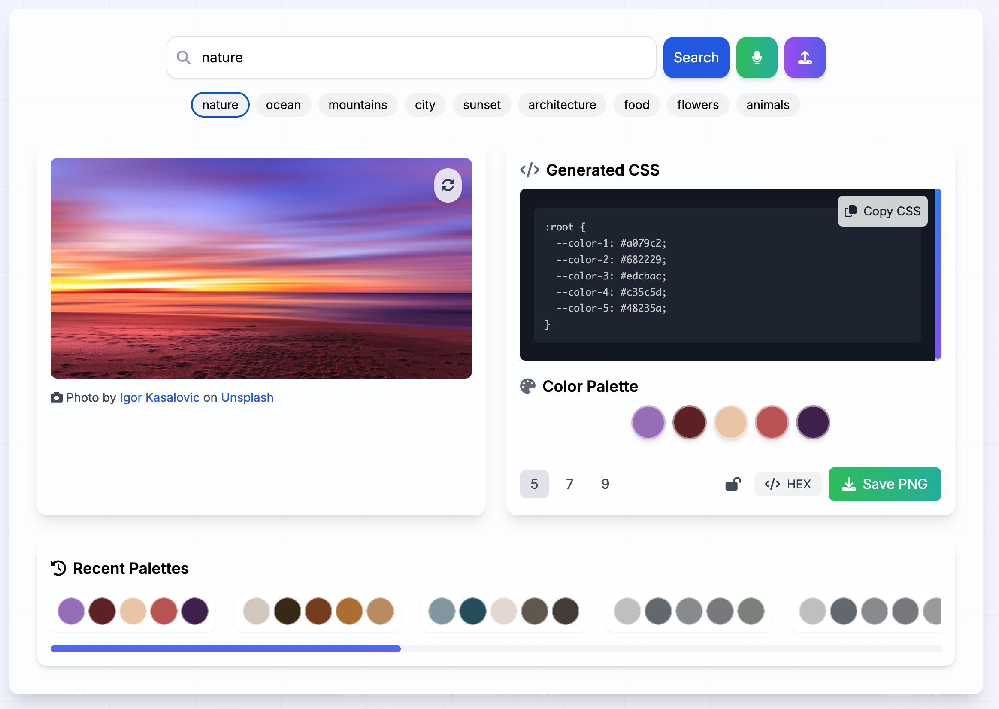

# Image Color Palette Generator 🎨

Generate a color palette from a random image based on your search query using the Unsplash API. 📸

## Features

-   Search for images using keywords
-   Generate a color palette from the image
-   Copy the generated CSS
-   Save the color palette as a PNG
-   Use voice search powered by the annyang Voice API 🎤

## Setup

### Prerequisites

-   **Node.js**: Ensure that you have Node.js installed on your system.
-   **Vercel account**: For deployment (optional).

### Installation

1. Clone the repository:

    ```bash
    git clone https://github.com/yourusername/color-palette-generator.git
    cd color-palette-generator
    ```

2. Install dependencies:

    ```bash
    npm install
    ```

3. Set up environment variables:

    - Create a `.env` file in the root directory and add your Unsplash API key:
        ```bash
        VITE_API_KEY=your_unsplash_api_key
        ```

4. Run the development server:

    ```bash
    npm run dev
    ```

5. Open your browser and visit `http://localhost:5173` to view the application.

## Technologies Used

-   **Vue.js**: Front-end framework for building user interfaces.
-   **Tailwind CSS**: Utility-first CSS framework for styling.
-   **Vite**: Build tool that provides fast, hot-reloading development environments.
-   **Axios**: Promise-based HTTP client used for API calls to Unsplash.
-   **ColorThief**: Library used for extracting the dominant colors from an image.
-   **html2canvas**: Library used for converting the color palette to a downloadable PNG image.
-   **Prism.js**: Syntax highlighting library for displaying CSS code with color previews.
-   **annyang**: Voice recognition library for enabling voice search functionality.

## Production

[Color Palette Generator](https://color-palette-generator-chi.vercel.app/)

## Screenshots




## How to Use

1. Enter a keyword and click "Search" to fetch a random image from Unsplash.
2. Use voice search by clicking the microphone icon.
3. View the generated color palette.
4. Copy the CSS or save the palette as a PNG.

## Environment Variables

The following environment variables need to be configured:

-   `VITE_API_KEY`: Your Unsplash API key.

## Deployment on Vercel

1. Push the repository to GitHub.
2. In your Vercel dashboard, import the project from GitHub.
3. Add your environment variable in Vercel:
    - `VITE_API_KEY`: Set this to your Unsplash API key.
4. Deploy the project.

## Unsplash API Guidelines

To comply with the Unsplash API guidelines:

-   **Reporting Image Views**: Use the `src` attribute of the image URLs provided by the API to report image views.
-   **Tracking Download Events**: Trigger a download event when a user downloads an image by making a request to the download URL provided by the Unsplash API.
-   **Attribution**: Provide proper attribution to the photographers and Unsplash.

## Legal and License

-   This project is licensed under the MIT License. Feel free to use, modify, and distribute it. The full license is available in the `LICENSE` file.
-   **Unsplash API Usage**: Make sure to comply with the [Unsplash API Terms of Use](https://unsplash.com/documentation#terms).

## Contributing

Pull requests are welcome! For major changes, please open an issue first to discuss what you would like to change.

## Author

-   **Peter Benoit**

## Contact

If you have any questions, feel free to reach out to me via GitHub or other platforms.
